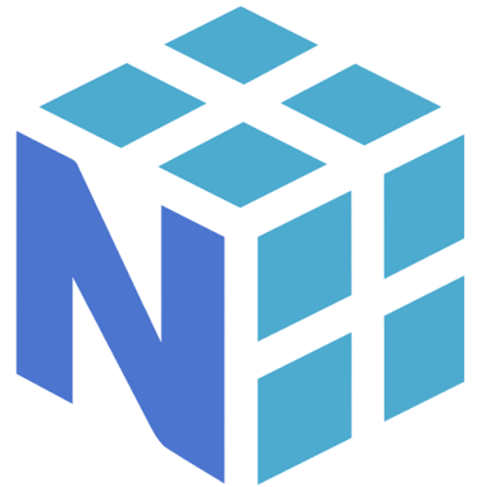
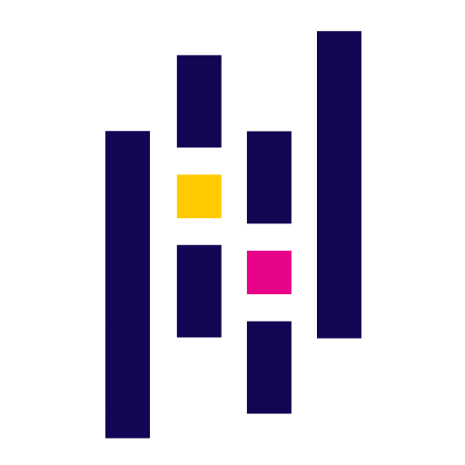
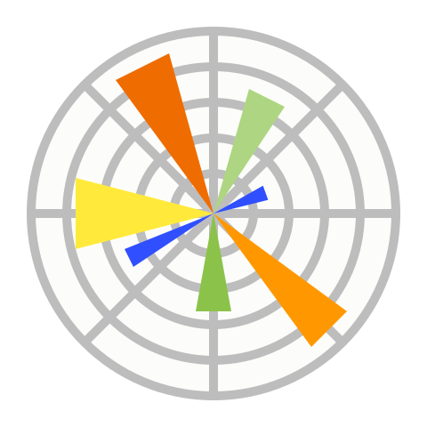

<!-- ===================== ANIMATED HEADER ===================== -->

---

# 👨‍💻 About Me 

### **Data Science • AI/ML • Web Development • UI Design**

🎓 B.E. Computer Engineering Student at **DVVPCOE**

> *"Consistency beats talent when talent doesn't stay consistent."*

 

---

# 🔥 Currently Working On 

*  Improving my **Python programming skills**
*  Learning **Data Science**
* 🌐 Practicing **HTML & Web Development**
* 💡 Building real-world projects

---

<!-- 

 -->
# 🧠 My Learning Journey

<table>
<tr>
<td align="center" width="500">

</td>

<td width="80">
</td>

<td align="center" width="500">

</td>
</tr>
</table>

---

# 🛠️ My Tech Stack 

These are the technologies, libraries and tools I am learning and working with.

<table>

<tr>

<td align="center" width="110">

 Python
</td>

<td align="center" width="110">

 HTML
</td>

<td align="center" width="110">

 Git
</td>

<td align="center" width="110">

 GitHub
</td>

<td align="center" width="110">

 VS Code
</td>

<td align="center" width="110">

 Anaconda
</td>

</tr>

<tr>

<td align="center">

 NumPy
</td>

<td align="center">

 Pandas
</td>

<td align="center">

 Scikit-Learn
</td>

<td align="center">

 TensorFlow
</td>

<td align="center">

 SciPy
</td>

<td align="center">

 Matplotlib
</td>

</tr>

</table>

 

 

A web-based **paper trading and learning platform** designed for students, beginners and new investors.

---

# 📊 GitHub Analytics 

 

---

---

# 🌐 Connect With Me 

   

---

